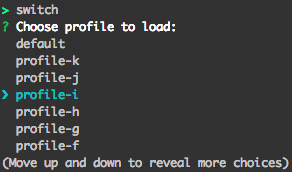

Switch
========

AWS Profile selector to switch between different profiles in the locally stored credentials file (`~/.aws/credentials`). The chosen profile is made the default so you can use the aws cli and/or the aws sdk without specifying profile.


Requirements
============

* [nodejs](https://nodejs.org/en/)

Install
=======
```shell
    git clone <repo>
    cd switcher
    npm install -g
```

Usage
=====
```shell
    switch
```

This will list all your current profiles from the credentials file located at `~/.aws/credentials`, choose one to make it the current default :



Credits
========

Switch icon created by [Arthur Shlain](https://thenounproject.com/ArtZ91/) and available at the [Noun Project](https://thenounproject.com/)
